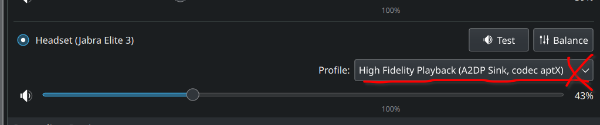

# My Proxmox Experience log

## Setup mini PC (SZBOX 7735HS)

Relatively straightforward installation of RAM and SSD. Top cover tricky to remove but all is well. Front USB port is extremely tight. Needed to use back USB port to properly plug in USB drive.

Unable to use Ventoy to install. Ventoy boots up fine but Proxmox does not like it. Made standalone Proxmox USB boot drive (using Etcher) and it worked well.

During installation, used following settings for network:

```bash
Network management interface: eno1
hostname: pve.local
IP Address: XXX.XXX.XXX.10/24 (XXX == first 3 groups of number in default gateway IP address)
Gateway: XXX.XXX.XXX.XXX (exactly as per default gateway, check router/mesh settings)
DNS Server: 8.8.8.8
```

## Networking

Current home network is:

Internet --> Modem Router --> Mesh --> Devices

TP Link Deco's Guest wifi network is isolated from the rest of the network. Need to use non-guest network to see local devices. (should have tested with ping to other local devices to check for local network IP isolation, if any)

Also unable to ping local devices if remote computer is on VPN (e.g. NordVPN).

EDIT: adding subnet to whitelist worked: <https://askubuntu.com/questions/1276829/nordvpn-local-network-addresses-not-reachable-when-connected>

```bash
nordvpn whitelist add subnet 192.168.[subnet].0/24
```

After set up as above, finally can connect to Proxmox web UI. However unable to ping google.com from shell. Checked network settings to be as follows (autostart and VLAN aware):


Also added secondary DNS `1.1.1.1`.

After this, ping Google worked.

## Post Install Scripts

Installed "Proxmox VE post install" script from here: <https://tteck.github.io/Proxmox/>

This script was run with all "yes". Took a while to complete because Proxmox was also updated in the process. (ran this script right after I got network working)

Did not need to install dark mode script as Proxmox 8.1 came default with dark theme enabled and activated.

Small scare as after post-install script completed, was unable to connect to it after reboot even after checking for wifi and VPN and ping to the IP was ok. But needed to wait an extra bit while before it all came back online.

## Expanding available space

Based on this video: <https://www.youtube.com/watch?v=_u8qTN3cCnQ&t=885s>

At Datacenter -> Storage -> `local-lvm` -> Remove.  
At PVE node -> Shell ->

```bash
lvremove /dev/pve/data
lvresize -l +100%FREE /dev/pve/root
resize2fs /dev/mapper/pve-root
```

After that, `local` still will not allow VM to be installed. `local` need to be explicitly allowed to install disk images to install VMs. To do this:

At Datacenter -> Storage -> `local` -> Edit -> Content -> Click everything.

VM creation should now be possible in `local`.

## VirGL on Proxmox VE

Ran the following commands:

```bash
sudo apt-get install libgl1-mesa-dev mesa-common-dev mesa-utils
sudo apt install libgl1 libegl1
```

2nd command above returned that all libraries are latest, so it could be unnecessary to run.

## Cliffnotes on Linux VM creation to virGL-compatible remtoe desktop

1. Install VM:

   ```bash
   Proxmox settings:
   BIOS: default
   Machine: q35
   CPU: host
   SSD emulation: on
   Discard: on
   ```

2. Update on successful post-install boot up

   ```bash
   sudo apt update
   sudo apt upgrade
   ```

3. Install stuffs

   - install Chromium from Software Manager

   - ```bash
      sudo apt install qemu-guest-agent
     ```

   - ```bash
      sudo apt install openssh-server
     ```

4. Install `sunshine`

   Download `sunshine` package from: <https://github.com/LizardByte/Sunshine/releases>

   - ```bash
      chmod +x sunshine-{ubuntu-version}.deb
     ```

   - ```bash
      sudo apt install -f ./sunshine-{ubuntu-version}.deb
     ```

   - ```bash
      sunshine
     ```

   - Enable `UPnP`.

5. Connect using `moonlight` from client side.

## Kubuntu VM creation

First creation: all defaults, 50GB, 16GB RAM, 8 cores. Tick Qemu-Agent checkbox.
Bunch of SQUASHFS errors appeared during first reboot after installation. Does not want to reboot properly. Killed it with force off, and it booted up normally.

```bash
sudo apt update
sudo apt upgrade
```

Install QEMU-agent to get IP-address to show up in Proxmox VM summary page: <https://pve.proxmox.com/wiki/Qemu-guest-agent>

```bash
sudo apt-get install qemu-guest-agent
```

At this point, sound does not work on the VM through web ui shell connection session (volume icon showing disabled/not available).

Install XRDP Easy Install script (just google and navigate the website to get latest script URI): <https://c-nergy.be/blog/?cat=79>

```bash
wget https://www.c-nergy.be/downloads/xRDP/xrdp-installer-1.4.8.zip
unzip xrdp-installer-1.4.8.zip
chmod +x xrdp-installer-1.4.8.sh
nano xrdp-installer-1.4.8.sh
===== add --enable-glamor flags in configure. See below =====
 ./xrdp-installer-1.4.8.sh -s
```

If installing xRDP on "non-approved" OS (such as KDE Neon 6), run following command:

`lsb_release -sd`

Then in the xRDP script, navigate to around line 374, and copy the switch case for one of the distros. Paste it as another switch case, then replace the distro with the output of `lsb_release -sd`, e.g.:

```bash
   *"KDE neon 6.0"*)
   /bin/echo -e "\e[1;32m       |-| OS Version : $version\e[0m"
   /bin/echo -e "\e[1;32m       |-| Desktop Version : $DesktopVer\e[0m"
	;;
```

Trick will not work if using "non-approved" desktop environment, because I'm not sure what to populate the configurations for. (relevant code for DE checks begins at line 189 )

Installation should proceed after that. Note that as this is a circumvention of xRDP Easy Install Script's safeguards, be prepared to nuke the installation if things go wrong.

Modify xRDP Easy Install script to include `--enable glamour` at the vonfigure step of `XRDP` and `XORG`, still no changes to virGL over XRDP. Info from : <https://gist.github.com/rkkoszewski/aa531cee7126edf329b76bdd0546f502>

`--enable-glamor --enable-rfxcodec --enable-mp3lame --enable-fdkaac --enable-opus --enable-pixman --enable-fuse --enable-jpeg --enable-ipv6`

Remember the `-s` flag!!!
TODO: Investigate the `-c` flag for custom installation with compilation from source. Necessary?

Machine settings: <https://forum.proxmox.com/threads/solved-vms-linux-and-windows-very-slow-and-laggy.104469/>  
Changed machine to q35  
Changed CPU to HOST

At destination machine:

```bash
sudo nano /etc/xrdp/xrdp.ini
```

Make following changes:

```bash
tcp_send_buffer_bytes=4194304
crypt_level=low
```

Remmina settings:

Color settings: GFX 32bpp  
Network: LAN


Seem like adding `latency:175` made an actual difference to sounds latency, less crackly/choppy sound.


From official docs:


Fix choppy audio by making sure `pulseaudio` is started:

```bash
pulseaudio --version
pulseaudio --start
```

Can try restart `pulseaudio`

```bash
pulseaudio -k
```

Somehow sometimes running `-k` after starting `pulseaudio` makes audio smoother. Not sure why.

If `pulseaudio` not installed: <https://itslinuxfoss.com/install-pulseaudio-ubuntu-22-04/>

Also tried uninstall default Remmina, and install the Flatpak version. On KDE Plasma need to install the Flatpak backend support plugin first, but the Remmina Flatpak file will automatically prompt to instll it on first click. <https://flathub.org/apps/org.remmina.Remmina>

For some reason, Flatpak Remmina is light theme only.

Flatpak Remmina has more codec options


But Flatpak version uses different directory for settings, so previous changes made in Snap Remmina is not carried over.

Alternative remote desktop solution: FreeRDP

check if FreeRDP is installed:

```bash
xfreerdp
```

Then make connection:

```bash
xfreerdp -f /u:[username] /p:[password] /v:[IP of destination] /sound:sys:pulse /dynamic-resolution +clipboard /network:lan /gfx:rfx /bpp:32 /sound:latency:20
```

Not sure how to get fullscreen toggle to work, because `CRTL+ALT+ENTER` never worked for me. Due to this, I still prefer Remmina. But need to find a way to make the options bar in Remmina dark instead of current white theme.

## Set up Guacamole

<https://github.com/boschkundendienst/guacamole-docker-compose>

## Misc

To check wifi from terminal: <https://askubuntu.com/questions/1401941/is-there-a-way-to-check-whether-my-device-is-currently-using-the-2-4-ghz-or-5-gh>

```bash
nmcli device wifi list
```

To connect to specific BSSID:  
`Settings` -> `Connections` -> `BBSID` dropdown


Use XPIPE as a general SSH manager: <https://xpipe.io/download>
Mainly use XPIPE to send files.

Need to start `ssh` server on host PC:

```bash
sudo apt-get install openssh-server
sudo service ssh status
```

Then need to allow port 22 in `ufw`:

```bash
sudo ufw allow ssh
```

For RDP apparently proper installation requires opening port 3389 on UFW:

```bash
sudo ufw allow 3389
```

Then:

```bash
sudo ufw status
```

If not started, then

```bash
sudo ufw enable
```

To kill firewall:

```bash
sudo ufw disable
```

To set time date format (esp for Linux Mint): <https://foragoodstrftime.com/>

```bash
23:27:30
1 Jan 2024
%H:%M:%S %n %d %b %Y
```

Built-in multi-line non-CLI text editors to be used when editting config files from CLI (instead of using `nano`):

Kubuntu: `kate`  
Linux Mint: `xed`

## virGL on Ubuntu Vm

`Somehow glxgears is showing better FPS in Linux Mint on virGL than Kubuntu. Youtube also has noticeably less dropped frames. Can consider as alternative to Kubuntu. Maybe virGL drivers not required because glxgears was tested on LMint before installing virGL drivers.`

Below for setup on Kubuntu:

Install VirGL drivers: <https://www.reddit.com/r/Proxmox/comments/v6p0om/amd_5750g_virgl_initial_benchmarks/>

Only able to get `glxgears -info` to show virGL when accessing VM through Proxmox shell. When accessing through xRDP, can only get `llvmpipe` no matter what.

Other ways to check:

`glxinfo -B`  
`dmesg | grep vga`  
`dmesg | grep virgl`

Went through GPU passthrough, but still showing `llvmpipe`, with suboptimal FPS when playing youtube 1080p60fps.

TODO: To investigate further.

Check Virtualization is available on CPU:

```bash
cat /proc/cpuinfo | grep vmx svm
```

Perhaps `X11Forwarding` is the answer? <https://stackoverflow.com/questions/61590691/the-xauthority-file-is-not-does-not-existhence-via-local-ssh-connection-displa>

On switching display manager: <https://techpiezo.com/linux/switch-display-manager-in-ubuntu-20-04/>

On `lightdm` greeter: <https://www.reddit.com/r/archlinux/comments/nr6sb2/new_to_arch_cant_start_lightdm/>

Forum thread to follow on progress of virGL (virtio-vga-gl): <https://forum.proxmox.com/threads/virglrenderer-for-3d-support.61801/page-4#:~:text=Yes%2C%20VGA%20==%20GPU%2C%20so%20VirtioGPU%20is,CLI/API%20or%20even%20Web%20UI.%20chrcoluk%20said>:.

## Windows VM creation

Need to pre-load virt-io driver iso, because drivers are needed to detect drives in the first step of installation. Select the appropriate `win` version when loading drivers to proceed.

Initial hiccup is that Windows 11 installation unable to proceed without network connection (no button to click next), need to reboot into `no network mode`: <https://learn.microsoft.com/en-us/answers/questions/1179311/windows-11-setup-without-internet>

Click `SHIFT+F10`

In the command prompt that appears:

`OOBE\BYPASSNRO`

Installation will reboot and proceed. However upon first boot, network will be unavailable. So reboot and network will be working.

First thing to install is virt-io drivers and virtio-win-guest-tools from the virtio iso.

Then need to install ExplorePatcher to make start menu show all apps instead of pinned apps: <https://github.com/valinet/ExplorerPatcher>

For RDP: Enable RDP in RDP settings.

Sound works out of the box in Win11. Youtube on Chrome works great without additional settings.

For max scrolling performance, use `GFX AVC444` color depth in Remmina.

Display scaling is wonky on Win11 VM via RDP. The clock at the taskbar is never affected by any DPI or text size setting. Just set Display Scaling to 125% and be done with it.

VirGL drivers for Windows still work in progress: <https://github.com/virtio-win/kvm-guest-drivers-windows/pull/943>

## GPU Passthrough

Below procedure taken from: <https://forum.proxmox.com/threads/pci-gpu-passthrough-on-proxmox-ve-8-installation-and-configuration.130218/>

1. editting `/etc/default/grub`

```bash
GRUB_CMDLINE_LINUX_DEFAULT="quiet  iommu=pt"
update-grub
reboot
```

Alternative config if passthrough fails:

```bash
GRUB_CMDLINE_LINUX_DEFAULT="quiet iommu=pt nomodeset pcie_acs_override=downstream initcall_blacklist=sysfb_init"
```

Another alternative config:

```bash
GRUB_CMDLINE_LINUX_DEFAULT="quiet iommu=pt pcie_acs_override=downstream,multifunction nofb nomodeset video=vesafb:off,efifb:off"
```

Extreme config:

```bash
GRUB_CMDLINE_LINUX_DEFAULT="quiet iommu=pt pcie_acs_override=downstream,multifunction video=efifb:off video=vesa:off vfio-pci.ids=10de:13bb,10de:0fb vfio_iommu_type1.allow_unsafe_interrupts=1 kvm.ignore_msrs=1 modprobe.blacklist=radeon,nouveau,nvidia,nvidiafb,nvidia-gpu"
```

From: <https://www.reddit.com/r/homelab/comments/b5xpua/the_ultimate_beginners_guide_to_gpu_passthrough/>  
Also: <https://www.reddit.com/r/Proxmox/comments/lcnn5w/proxmox_pcie_passthrough_in_2_minutes/>  
Further reading: <https://www.reddit.com/r/homelab/comments/11l0s5j/boxmox_asrock_4x4_box_5800u_jbod_proxmox/>  
Graphical gudie (ignore part about vfio_virqfd): <https://3os.org/infrastructure/proxmox/gpu-passthrough/igpu-passthrough-to-vm/#linux-virtual-machine-igpu-passthrough-configuration>  
More: <https://github.com/isc30/ryzen-7000-series-proxmox>

2. editting `/etc/modules`

Add the following lines:

```bash
vfio
vfio_iommu_type1
vfio_pci
```

Then run:

```bash
update-initramfs -u -k all
systemctl reboot
```

Verify status of VFIO:

```bash
dmesg | grep -i vfio
```

Should see something similar to:`[ 7.262027] VFIO - User Level meta-driver version: 0.3`

3. Verify remapping:

```bash
dmesg | grep 'remapping'
```

Should see `AMD-Vi: Interrupt remapping enabled` or `DMAR-IR: Enabled IRQ remapping in x2apic mode`

Else:

```bash
echo "options vfio_iommu_type1 allow_unsafe_interrupts=1" > /etc/modprobe.d/iommu_unsafe_interrupts.conf
```

4. Additional AMD setup (and driver block):

```bash
apt install pve-headers-$(uname -r)
apt install git dkms build-essential
git clone https://github.com/gnif/vendor-reset.git
cd vendor-reset
dkms install .
echo "vendor-reset" >> /etc/modules
update-initramfs -u
shutdown -r now
```

Retrieve PCI ID of GPU:

```bash
lspci -nn | grep 'AMD'
```

For 7735HS, results include:

```bash
...
05:00.0 VGA compatible controller [0300]: Advanced Micro Devices, Inc. [AMD/ATI] Rembrandt [Radeon 680M] [1002:1681] (rev 0a)
05:00.1 Audio device [0403]: Advanced Micro Devices, Inc. [AMD/ATI] Rembrandt Radeon High Definition Audio Controller [1002:1640]
...
```

In this case, PCI ID for GPU is `05:00.0`.

Full extracted info is:

```bash
GPU: 1002:1681
Audio: 1002:1640
```

Next create the service for vendor reset (AMD bug):

```bash
cat << EOF >>  /etc/systemd/system/vreset.service
[Unit]
Description=AMD GPU reset method to 'device_specific'
After=multi-user.target
[Service]
ExecStart=/usr/bin/bash -c 'echo device_specific > /sys/bus/pci/devices/0000:05:00.0/reset_method'
[Install]
WantedBy=multi-user.target
EOF
systemctl enable vreset.service && systemctl start vreset.service
```

Should see a bunch of dmesg during start up (example, 7735HS is not POLARIS):

```bash
[57709.971750] vfio-pci 0000:01:00.0: AMD_POLARIS10: version 1.1
[57709.971755] vfio-pci 0000:01:00.0: AMD_POLARIS10: performing pre-reset
[57709.971881] vfio-pci 0000:01:00.0: AMD_POLARIS10: performing reset
[57709.971885] vfio-pci 0000:01:00.0: AMD_POLARIS10: CLOCK_CNTL: 0x0, PC: 0x2055c
[57709.971889] vfio-pci 0000:01:00.0: AMD_POLARIS10: Performing BACO reset
[57710.147491] vfio-pci 0000:01:00.0: AMD_POLARIS10: performing post-reset
[57710.171814] vfio-pci 0000:01:00.0: AMD_POLARIS10: reset result = 0
```

Perform Soft deps to block drivers from loading on host:

```bash
echo "options vfio-pci ids=1002:1681,1002:1640" >> /etc/modprobe.d/vfio.conf
# For AMD
echo "softdep radeon pre: vfio-pci" >> /etc/modprobe.d/vfio.conf
echo "softdep amdgpu pre: vfio-pci" >> /etc/modprobe.d/vfio.conf
echo "softdep snd_hda_intel pre: vfio-pci" >> /etc/modprobe.d/vfio.conf
echo "softdep xhci_pci pre: vfio-pci" >> /etc/modprobe.d/vfio.conf
# For Nvidia
echo "softdep nouveau pre: vfio-pci" >> /etc/modprobe.d/vfio.conf
echo "softdep nvidia pre: vfio-pci" >> /etc/modprobe.d/vfio.conf
echo "softdep nvidiafb pre: vfio-pci" >> /etc/modprobe.d/vfio.conf
echo "softdep nvidia_drm pre: vfio-pci" >> /etc/modprobe.d/vfio.conf
echo "softdep drm pre: vfio-pci" >> /etc/modprobe.d/vfio.conf
# For Intel
echo "softdep snd_hda_intel pre: vfio-pci" >> /etc/modprobe.d/vfio.conf
echo "softdep snd_hda_codec_hdmi pre: vfio-pci" >> /etc/modprobe.d/vfio.conf
echo "softdep i915 pre: vfio-pci" >> /etc/modprobe.d/vfio.conf
```

If softdeps don't work, then need to proceed to blacklist drivers:

```bash
echo "options vfio-pci ids=1002:1681,1002:1640" >> /etc/modprobe.d/vfio.conf
```

Skip above if already done before.

```bash
# AMD drivers
echo "blacklist radeon" >> /etc/modprobe.d/blacklist.conf
echo "blacklist amdgpu" >> /etc/modprobe.d/blacklist.conf
# NVIDIA drivers
echo "blacklist nouveau" >> /etc/modprobe.d/blacklist.conf
echo "blacklist nvidia" >> /etc/modprobe.d/blacklist.conf
echo "blacklist nvidiafb" >> /etc/modprobe.d/blacklist.conf
echo "blacklist nvidia_drm" >> /etc/modprobe.d/blacklist.conf
# Intel drivers
echo "snd_hda_intel" >> /etc/modprobe.d/blacklist.conf
echo "snd_hda_codec_hdmi" >> /etc/modprobe.d/blacklist.conf
echo "i915" >> /etc/modprobe.d/blacklist.conf
```

Additional checking stuff can be found from Proxmox forum post above.

In the VM conf file: <https://nopresearcher.github.io/Proxmox-GPU-Passthrough-Ubuntu/>

```bash
nano /etc/pve/qemu-server/(VMID).conf
hostpci0: 01:00,x-vga=on
```

Make sure `,x-vga=on` is included.

## Moonlight+Sunshine

Having xRDP stubbornly only use `llvmpipe`, and GPU passthrough seeming to not make a difference over xRDP, decided to use Moonlight+Sunshine.

Host/server side, installed the latest package at LizardByte github: <https://github.com/LizardByte/Sunshine/releases>

Exact steps for installation: <https://docs.lizardbyte.dev/projects/sunshine/en/latest/about/installation.html#debian-package>

After downloading the `sunshine-ubuntu-22.04-{arch}.deb` file, install:

```bash
sudo apt install -f ./sunshine-{ubuntu-version}.deb
```

Before starting `sunshine` service, need to login to VM from Proxmox shell, just in case previous step was done via xRDP or other means. Starting `sunshine` will not work over xRDP because it needs a display to attach to, which xRDP is already occupying if currenty connected via xRDP.

On usage of `sunshine`: <https://docs.lizardbyte.dev/projects/sunshine/en/latest/about/usage.html#usage>

To start `sunshine` service after installed and logged in via Proxmox shell, run:

```bash
sunshine
```

Then a bunch of mumbo jumbo will appear in the terminal, culminating with something that looks like:

```bash
Configuration UI available at [https://localhost:47990]
```

Point browser to `https://localhost:47990` on host/server, then set up `username` and `password`.

Then install `moonlight` on client PC: <https://github.com/moonlight-stream/moonlight-qt/releases>

I chose to install via Snap store: <https://snapcraft.io/moonlight> (previous attempt using Flatpak yielded subpar results.)

```bash
sudo snap install moonlight
```

Then open `moonlight` from app menu. Had to manually add host/server IP via [+] icon at top right to get it to detect.

Moonlight settings:

```bash
resolution: 1920x1080
frame rate: 60fps
Video bitrate: 20Mbps (higher causes crackly audio)
Optimise mouse for remote desktop: OFF
```

Also need to ensure client side connection is good, preferably connect to 5Ghz WiFi if LAN connection to common router is not possible.

Need to have access to both client and server to establish connection, because need to type in PIN at server side to pair the devices for connection.

Full desktop is piped through. Since no new session is started, no problem with virGL.

If got problem establishing connection, might have to open ports on server side. Required ports are shown in Web UI -> Advanced.

```bash
ufw allow 47984/tcp
ufw allow 47989/tcp
ufw allow 48010/tcp
ufw allow 47998/udp
ufw allow 47999/udp
ufw allow 48000/udp
ufw allow 48002/udp
ufw allow 48010/udp
```

Alternatively, turn on `UPnP` in Sunshine Settings under `Network`.

Downside to `moonlight` is that need to login to server device to start the `sunshine` service, which means no autologin/start on bootup, unless specially set up to do from server side (unlike xRDP where connection can be established without needing to be logged in locally first). Reference info (did not execute): <https://forum.level1techs.com/t/how-to-set-up-headless-sunshine-on-ubuntu-server-22-04-with-an-nvidia-gpu/197106>

Windows does not have virGL drivers yet, so no point in installing `sunshine` on it because it will still only use VirtIO drivers, which is software rendering. Though Moonlight automatically detects the server once `sunshine` is properly installed on a Windows VM, without having to input IP address manually.

FIX: Sunshine dies from time to time (once per hour with error `drm fb`). Run: <https://docs.lizardbyte.dev/projects/sunshine/en/latest/troubleshooting/linux.html>

```bash
sudo setcap -r $(readlink -f $(which sunshine))
```

## Notes on Gnome

Install gnome-shell-extension-manager: <https://github.com/mjakeman/extension-manager>

```bash
sudo apt install gnome-shell-extension-manager
```

Remember to check if an extension manager is already installed before installing this one.

Install `Dash to Panel` extension to make taskbar go to bottom like Plasma and Cinnammon.

## Notes on Debian

To activate non-free firmware, open Software Centre, menu, then select non-free repos.

On `sunshine` session, cursor does not appear. To fix, set accessbility zoom level to `1.0`.

Mouse acceleration setting is under Keyboard and Mouse Tweaks. Mouse speed is under mouse settings.

Maximise and Minimise button at window decoration is also under Tweaks.

## On Adding Multiple Users

```bash
sudo adduser newuser
sudo nano /etc/sudoers


```

Scroll down until the line that says:

```bash
# User privilege specification
root    ALL=(ALL:ALL) ALL
```

Add `newuser` to below `root`:

```bash
newuser    ALL=(ALL:ALL) ALL
```

Save and exit file.

### Setup shared folder between multiple users

Info from: <https://www.tutorialspoint.com/how-to-create-a-shared-directory-for-all-users-in-linux>

```bash
sudo mkdir -p /whateverSharedDirectory
sudo groupadd [name for shared users group for this new folder]
sudo chgrp -R [name for shared users group for this new folder] /whateverSharedDirectory
sudo chmod -R 2775 /whateverSharedDirectory
sudo usermod -aG [name for shared users group for this new folder] user1
sudo usermod -aG [name for shared users group for this new folder] user2
```

## Set static IP

Info: <https://www.freecodecamp.org/news/setting-a-static-ip-in-ubuntu-linux-ip-address-tutorial/>

Modify `/etc/netplan/01-network-manager-all.yaml` as follows:

```yaml
network:
 version: 2
 renderer: NetworkManager
 ethernets:
   eth0:
     dhcp4: no
     addresses: "STATIC ADDRESS /24 or whatever ifconfig -a says"
     gateway4: "default gateway IP"
     nameservers:
         addresses: [8.8.8.8,8.8.8.4] or 1.1.1.1 for cloudflare
```

## Bluetooth headset mic input fix

Technically not for VM, but for locally installed Linux (Ubuntu) installation.

Info: <https://www.reddit.com/r/pop_os/comments/ol9nxx/installing_latest_pipewire_with_working_bluetooth/>

Steps replicated here for ease of reference:

Install PPA for latest pipewire

```bash
sudo add-apt-repository ppa:pipewire-debian/pipewire-upstream (this ppa user builds from arch upstream)
sudo apt-get update
```

Install deps and codecs

```bash
sudo apt install libfdk-aac2 libldacbt-{abr,enc}2 libopenaptx0
sudo apt install libspa-0.2-{bluetooth,dev,modules}
```

Disable pulseaudio

```bash
systemctl --user --now disable pulseaudio.{socket,service}
systemctl --user mask pulseaudio
```

Remove pulseaudio-module-bluetooth otherwise your bluetooth devices will not

```bash
sudo apt remove pulseaudio-module-bluetooth
```

Enable pipewire

```bash
systemctl --user --now enable pipewire{,-pulse}.{socket,service} pipewire-media-session.service
```

Verify pipewire is working (you should see pipewire mentioned)

```bash
pactl info | grep '^Server Name'
```

Reboot

If still not working, remove bluetooth device and re-add.

Might have to check audio settings and switch profile to HSP/HFP:




After that, bluetooth headset mic should appear with auto selected HSP/HFP profile.
