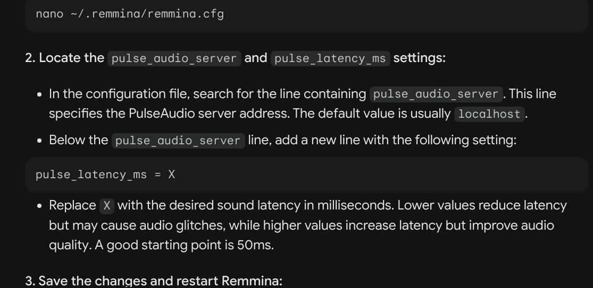

# My Proxmox Experience log

## Setup mini PC (SZBOX 7735HS)

Relatively straightforward installation of RAM and SSD. Top cover tricky to remove but all is well. Front USB port is extremely tight. Needed to use back USB port to properly plug in USB drive.

Unable to use Ventoy to install. Ventoy boots up fine but Proxmox does not like it. Made standalone Proxmox USB boot drive (using Etcher) and it worked well.

During installation, used following settings for network:

```bash
Network management interface: eno1
hostname: pve.local
IP Address: XXX.XXX.XXX.10/24 (XXX == first 3 groups of number in default gateway IP address)
Gateway: XXX.XXX.XXX.XXX (exactly as per default gateway, check router/mesh settings)
DNS Server: 8.8.8.8
```

## Networking

Current home network is:

Internet --> Modem Router --> Mesh --> Devices

TP Link Deco's Guest wifi network is isolated from the rest of the network. Need to use non-guest network to see local devices. (should have tested with ping to other local devices to check for local network IP isolation, if any)

Also unable to ping local devices if remote computer is on VPN (e.g. NordVPN).

EDIT: adding subnet to whitelist worked: <https://askubuntu.com/questions/1276829/nordvpn-local-network-addresses-not-reachable-when-connected>

```bash
nordvpn whitelist add subnet 192.168.[subnet].0/24
```

After set up as above, finally can connect to Proxmox web UI. However unable to ping google.com from shell. Checked network settings to be as follows (autostart and VLAN aware):


Also added secondary DNS `1.1.1.1`.

After this, ping Google worked.

## Post Install Scripts

Installed "Proxmox VE post install" script from here: <https://tteck.github.io/Proxmox/>

This script was run with all "yes". Took a while to complete because Proxmox was also updated in the process. (ran this script right after I got network working)

Did not need to install dark mode script as Proxmox 8.1 came default with dark theme enabled and activated.

Small scare as after post-install script completed, was unable to connect to it after reboot even after checking for wifi and VPN and ping to the IP was ok. But needed to wait an extra bit while before it all came back online.

## Expanding available space

Based on this video: <https://www.youtube.com/watch?v=_u8qTN3cCnQ&t=885s>

At Datacenter -> Storage -> `local-lvm` -> Remove.  
At PVE node -> Shell ->  

```bash
lvremove /dev/pve/data
lvresize -l +100%FREE /dev/pve/root
resize2fs /dev/mapper/pve-root
```

After that, ```local``` still will not allow VM to be installed. `local` need to be explicitly allowed to install disk images to install VMs. To do this:

At Datacenter -> Storage -> `local` -> Edit -> Content -> Click everything.

VM creation should now be possible in `local`.

## VirGL

Ran the following commands:

```bash
sudo apt-get install libgl1-mesa-dev mesa-common-dev mesa-utils
sudo apt install libgl1 libegl1
```

2nd command above returned that all libraries are latest, so it could be unnecessary to run.

## VM creation

First creation: all defaults, 50GB, 16GB RAM, 8 cores. Tick Qemu-Agent checkbox.
Bunch of SQUASHFS errors appeared during first reboot after installation. Does not want to reboot properly. Killed it with force off, and it booted up normally.

```bash
sudo apt update
sudo apt upgrade
```

Install QEMU-agent to get IP-address to show up in Proxmox VM summary page: <https://pve.proxmox.com/wiki/Qemu-guest-agent>

```bash
sudo apt-get install qemu-guest-agent
```

At this point, sound does not work on the VM through web ui shell connection session (volume icon showing disabled/not available).

Install XRDP Easy Install script (just google and navigate the website to get latest script URI): <https://c-nergy.be/blog/?cat=79>

```bash
wget https://www.c-nergy.be/downloads/xRDP/xrdp-installer-1.4.8.zip
unzip xrdp-installer-1.4.8.zip 
chmod +x  xrdp-installer-1.4.8.sh
./xrdp-installer-1.4.8.sh -s
```

Remember the `-s` flag!!!
TODO: Investigate the `-c` flag for custom installation with compilation from source. Necessary?

Below strikethrough section are kept for historical reasons. Not necessary to follow.

~~In improving xRDP performance, tried: <https://superuser.com/questions/1539900/slow-ubuntu-remote-desktop-using-xrdp>~~
~~Also read: <https://askubuntu.com/questions/1283709/xrdp-and-xfce4-ubuntu-18-04-unusable/1283785#1283785>~~

~~Made modifications as follows: <https://askubuntu.com/questions/1323601/xrdp-is-quite-slow>~~

~~Also added xrdp.conf: <https://www.suse.com/support/kb/doc/?id=000021159>~~

^^^ End Strikethrough ^^^

Machine settings: <https://forum.proxmox.com/threads/solved-vms-linux-and-windows-very-slow-and-laggy.104469/>  
Changed machine to q35
Changed CPU to HOST

WHAT FINALLY WORKED:  
Remmina settings:

Color settings: GFX 32bpp  
Network: LAN  


Also added `pulse_latency_ms=50` to `~/.local/share/remmina/[group-rdp-VM_NAME_IN_REMMINA-IP_ADDRESS.remmina]`. Not sure if it works, but solution is from Google Bard, but no other source mentioned this setting.



Alternative remote desktop solution: FreeRDP

check if FreeRDP is installed:

```bash
xfreerdp
```

Then make connection:

```bash
xfreerdp -f /u:[username] /p:[password] /v:[IP of destination] /sound:sys:pulse /dynamic-resolution +clipboard /network:lan /gfx:rfx /bpp:32 /sound:latency:20
```
Not sure how to get fullscreen toggle to work, because `CRTL+ALT+ENTER` never worked for me. Due to this, I still prefer Remmina. But need to find a way to make the options bar in Remmina dark instead of current white theme.

Note: ~~strikethrough~~ parts kept for historical reasons. Not necessary to adopt.

## Misc

To check wifi from terminal: <https://askubuntu.com/questions/1401941/is-there-a-way-to-check-whether-my-device-is-currently-using-the-2-4-ghz-or-5-gh>

```bash
nmcli device wifi list
```

To connect to specific BSSID:  
`Settings` -> `Connections` -> `BBSID` dropdown


